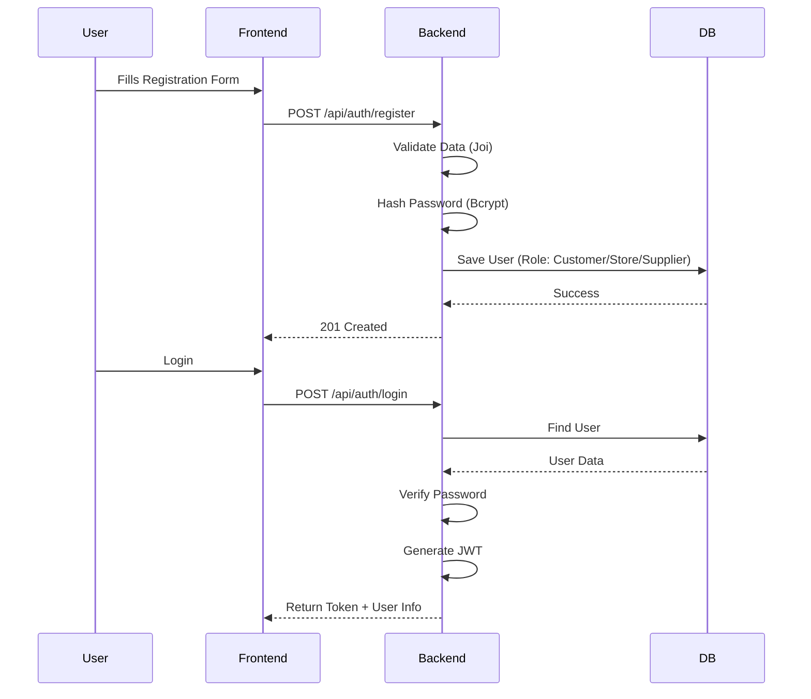
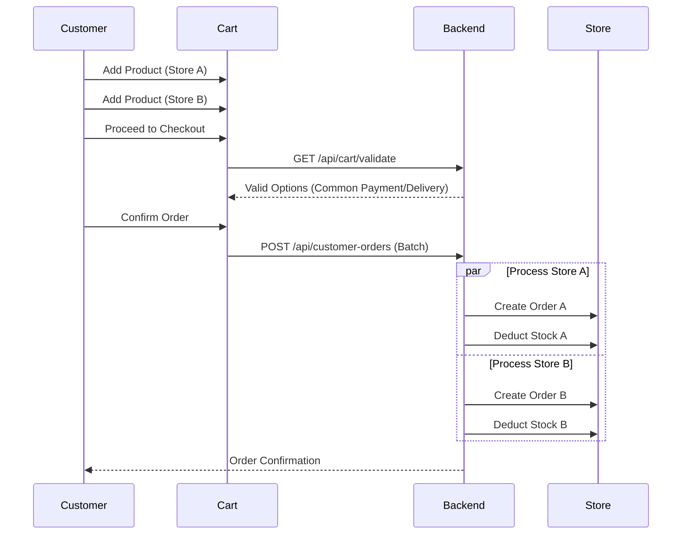
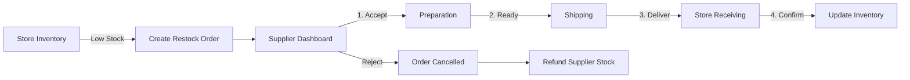
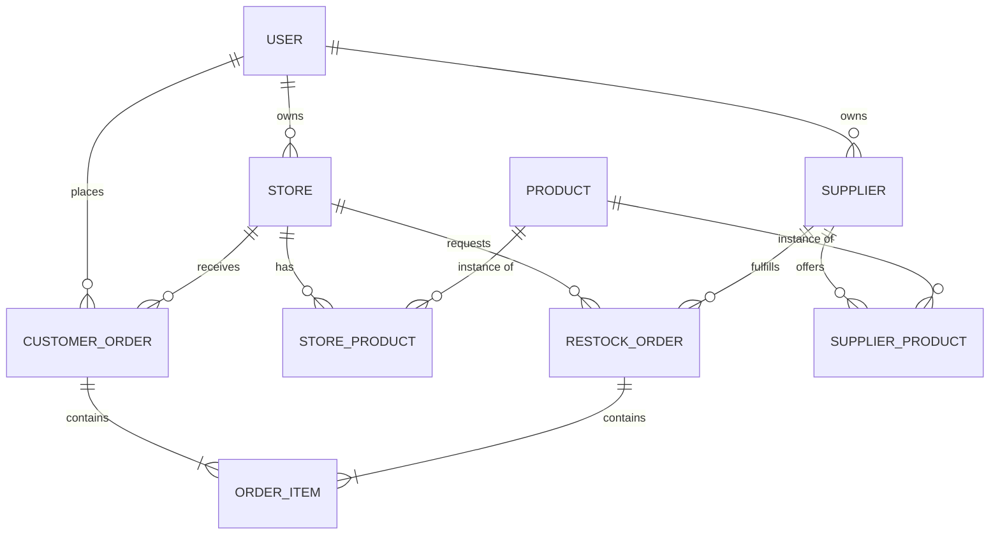

# 📊 System Diagrams

Visual representations of the core workflows and data structures in GlobalStore.

## 🔐 Registration & Auth Flow

## 🛒 Customer Ordering Flow

## 🚛 Restock Flow (B2B)

## 🗄️ Database Schema (Simplified)

