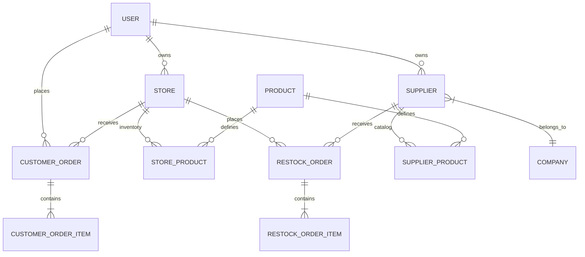

# 📊 Data Models & Relationships

GlobalStore utilizes **MongoDB** as its primary data store, with **Mongoose** providing a structured ODM layer. The schema is designed for eventual consistency and high-performance reads through strategic indexing and data snapshots.

## 🗺️ Entity Relationship Diagram (ERD)

## 📄 Core Schemas

### 1. User (`User.js`)
Stores account credentials and metadata.
-   **Roles**: `['admin', 'customer', 'store', 'supplier', 'company', 'company_admin']`.
-   **Address**: Embedded object with street, neighborhood, municipality, state, etc.
-   **Status**: Active/Inactive flag for account management.

### 2. Product (`Product.js`)
The "Global Catalog". These items don't have stock or price; they define the *essence* of the product.
-   **Identification**: Barcode (optional), Name, Description.
-   **Attributes**: Category, Brand (Company), Unit of measure.

### 3. Inventory Models
-   **StoreProduct**: Links a Global Product to a specific Store. Adds `retailPrice`, `stock`, and `active` status.
-   **SupplierProduct**: Links a Global Product to a specific Supplier. Adds `wholesalePrice`, `minimumOrder`, and `availability`.

### 4. Order Models
-   **CustomerOrder**:
    -   Multiple items with snapshots (name, price at time of purchase).
    -   Totals: Subtotal, Tax, Delivery Fees, Discounts.
    -   Statuses: `CREADA`, `PAGADA`, `EN_CAMINO`, `ENTREGADA`, etc.
-   **RestockOrder**:
    -   B2B order from Store to Supplier.
    -   Includes a hashed `deliveryCode` for secure hand-off confirmation.

## ⚡ Indexing Strategy

To maintain performance as the database grows, we implement the following index patterns:

| Index Type | Example Context | Purpose |
| :--- | :--- | :--- |
| **Unique** | `User.email`, `Product.barcode` | Prevents duplicates. |
| **Compound** | `storeId + status + createdAt` | Optimizes dashboard filtering. |
| **Text** | `Product.name + Product.company` | Powering the platform-wide search. |
| **Sparse** | `User.tenantId` | Supports multi-tenancy optionally. |

## 📸 Data Snapshots
To prevent historical data corruption when a product price or name changes, **Orders** store snapshots of the item details at the moment the order was placed. This ensures that a receipt generated 1 year later reflects the actual price paid at that time.
