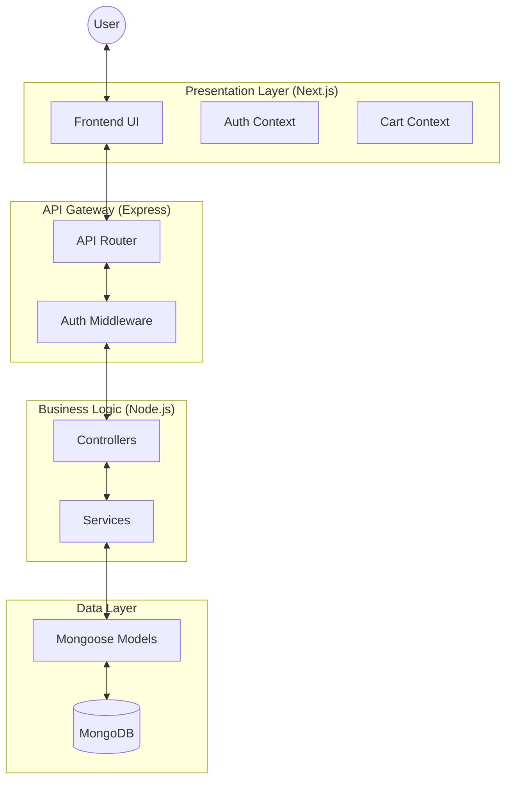

# 🏗️ System Overview

GlobalStore is a multi-role e-commerce platform designed to connect the entire retail supply chain. It facilitates interaction between **Customers**, **Stores**, **Suppliers**, and **Companies** through a centralized digital ecosystem.

## 🧩 Core Concept

The platform operates as a **Micro-Modular Monolith**. While it lives in a single repository (monolith) for development simplicity, it is architecturally separated into distinct layers and modules that act like microservices in their logic separation.

### High-Level Topology

## 🏗️ Architectural Patterns

### 🔹 Layered Architecture (Backend)
The backend follows a strict **Controller-Service-Model** pattern:
1.  **Routes**: Defines the entry points (e.g., `/api/products`).
2.  **Controllers**: Responsible for parsing the request, calling the appropriate service, and sending the formatted response.
3.  **Services**: The "brain" of the application. All business logic, stock calculations, and permission checks live here.
4.  **Models (Mongoose)**: Defines the data structure and handle direct database interactions.

### 🔹 Component-Based Architecture (Frontend)
The frontend uses **Next.js 14** with the App Router:
-   **Client Components**: Handle interactivity (forms, maps, cart).
-   **Layouts**: Provide consistent navigation (Sidebar/Navbar) across dashboards.
-   **Context API**: Manages global state for authentication and shopping cart persistence.

## 👥 Multi-Role Logic
The system's USP (Unique Selling Proposition) is its multi-tenant, multi-role design:
-   **Customers**: View aggregated products from multiple stores.
-   **Stores**: Act as both *sellers* (to customers) and *buyers* (from suppliers).
-   **Suppliers**: Wholesale providers for stores.
-   **Companies**: High-level entities that own global product definitions and approve suppliers.

## 🔄 Lifecycle of a Product
1.  **Definition**: Created by a **Company** or **Admin** in the Global Catalog.
2.  **Listing**: Linked by a **Supplier** with wholesale pricing.
3.  **Procurement**: Ordered by a **Store** to replenish stock.
4.  **Retail**: Listed by the **Store** with retail pricing.
5.  **Consumption**: Purchased by a **Customer**.
